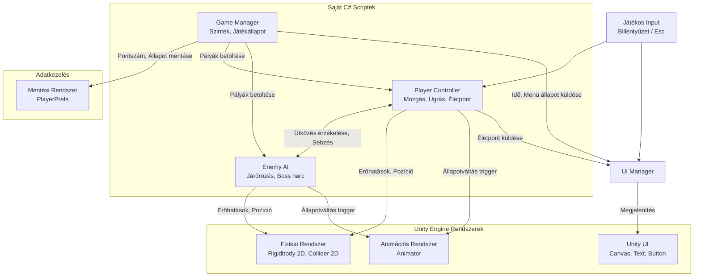

# mosze-jatekfejlesztes

SZE MOSZE 2025/26-2 játékfejlesztési projekt

## Aetheria - Rövid áttekintés

Az Aetheria egy 2D akció-platformer kalandjáték, amelyben a játékos célja, hogy egy veszélyekkel teli torony szintjein felfelé haladva megmentse az elrabolt királylányt.

A játék fantasy világban játszódik, ahol a torony minden szintje új kihívásokat tartogat:

- mozgó platformok
- csapdák és terepakadályok
- különböző viselkedésű ellenfelek
- fokozatosan növekvő nehézség

## Főbb játékelemek

- gyors, pontos időzítést igénylő mozgás
- ugrás és haladás platformokon keresztül
- ellenfél-interakciók és sebződés
- több pályatípus: ellenséges, puzzle és boss pálya

## Irányítás

| Billentyű | Funkció       |
| :-------- | :------------ |
| A         | Balra mozgás  |
| D         | Jobbra mozgás |
| Space     | Ugrás         |
| Esc       | Szünet menü   |

## Projekt futtatása

- A repository klónozása
- Unity Hub-ban: Add Project -> from disk -> a klónozott mappa kiválasztása
- A projekt megnyitása után a Scenes mappában dupla kattintás a GameScene-re
- Play gombbal futtatható a játék
- Frissítéshez: git pull

### Rendszerarchitektúra

A játék az alábbi főbb komponensekből és Unity rendszerekből épül fel:

